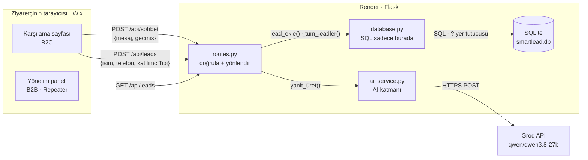

# SmartLead AI — SUNDIA SPACE

**SUNDIA SPACE**, çocuk, ergen, yetişkin ve kurumlara yönelik sanat, müzik,
hareket, drama, duyusal keşif ve dijital sanat temelli atölye ve programlar
geliştiren yaratıcı alan markasıdır.

Bu sistem, ziyaretçiyle yapay zekâ üzerinden sohbet edip **program talebi**
toplayan bir karşılama asistanıdır.

İki arayüz: ziyaretçinin sohbet edip iletişim bıraktığı **karşılama sayfası** ve
ekibin talepleri gördüğü **yönetim paneli**.

> **Konumlandırma:** SUNDIA SPACE bir sağlık kuruluşu, klinik veya terapi merkezi
> değildir. Çerçeve kültürel eğitim ve yaratıcı çalışmalardır. Asistan *terapi,
> seans, tedavi, hasta, danışan* gibi klinik ifadeleri kullanmaz; **atölye,
> program, katılımcı, eğitmen** der. Risk içeren bir ifade geçtiğinde sohbeti
> sürdürmez, 112'ye yönlendirir.

**Yığın:** Python · Flask · SQLite · Groq (`qwen/qwen3.8-27b`) · Wix Velo · Render

> Groq zaman zaman model adlarını değiştirir. `does not exist or you do not have
> access to it` hatası alırsan hesabındaki güncel listeyi şöyle görebilirsin:
> ```bash
> curl -s https://api.groq.com/openai/v1/models \
>   -H "Authorization: Bearer $GROQ_API_KEY" | grep '"id"'
> ```
> Ardından `.env` içindeki `AI_MODEL` değerini güncelle — kodda hiçbir şey değişmez.

> **Konumlandırma:** SUNDIA SPACE bir sağlık kuruluşu, klinik veya terapi
> merkezi değildir. Çerçeve kültürel eğitim ve yaratıcı çalışmalardır.
> Asistan *terapi, seans, tedavi, hasta, katılımcı yerine "danışan"* gibi
> klinik ifadeleri kullanmaz; **atölye, program, katılımcı, eğitmen** der.
> Risk içeren bir ifade geçtiğinde sohbeti sürdürmez, 112'ye yönlendirir.

---

## Nasıl çalışır?



`routes.py` hiçbir zaman doğrudan Groq'a veya SQLite'a dokunmaz — her zaman
aradaki katmanı çağırır. Değerlendirmenin %30'u bu kurala bakıyor.

## Mimari — Sorumlulukların Ayrılığı

```
smartlead_ai/
├── run.py                     → sunucuyu başlatan giriş noktası
├── config.py                  → TÜM ayarlar ve anahtarlar (.env okur)
├── requirements.txt
├── .env                       → gizli anahtarlar (Git'e EKLENMEZ)
├── .env.example               → şablon (Git'e eklenir)
│
├── app/
│   ├── __init__.py            → uygulama fabrikası (create_app)
│   ├── database.py            → veritabanı işlemleri  ← SQL SADECE BURADA
│   ├── routes.py              → HTTP rotaları         ← sadece yönlendirme
│   ├── templates/
│   │   ├── index.html         → karşılama (yerel test arayüzü)
│   │   └── dashboard.html     → yönetim paneli (yerel test arayüzü)
│   └── services/
│       └── ai_service.py      → yapay zekâ çağrıları  ← AI SADECE BURADA
│
└── wix/                       → Wix Velo'ya yapıştırılacak frontend kodu
    ├── karsilama-sayfasi.js
    └── yonetim-paneli.js
```

**Mimari sözleşme:** `database.py` dışında hiçbir yerde SQL, `ai_service.py`
dışında hiçbir yerde yapay zekâ çağrısı olmaz. `routes.py` yalnızca bu iki
katmanın fonksiyonlarını çağırır. *(Değerlendirmenin %30'u)*

---

## Kurulum

```bash
# 1) Sanal ortam
python3 -m venv venv
source venv/bin/activate          # bash/zsh
source venv/bin/activate.fish     # fish

# 2) Bağımlılıklar
pip install -r requirements.txt

# 3) Ayarlar
cp .env.example .env
# .env içine Groq anahtarını yapıştır (console.groq.com > API Keys)

# 4) Çalıştır
python run.py                     # http://localhost:5001
```

> **macOS notu:** Port **5000** işletim sisteminin *AirPlay Receiver*
> servisi tarafından kullanılır ve her isteğe `403` döner. Bu yüzden proje
> **5001** portunda çalışır. İstersen *Sistem Ayarları → Genel → AirDrop ve
> Handoff → AirPlay Alıcısı*'nı kapatıp 5000'e dönebilirsin.

---

## API

| Metod | Yol | Gövde | Yanıt |
|-------|-----|-------|-------|
| `GET` | `/health` | — | `{"durum": "aktif"}` |
| `POST` | `/api/sohbet` | `{"mesaj": "...", "gecmis": []}` | `{"basari": true, "cevap": "..."}` |
| `POST` | `/api/leads` | `{"isim": "...", "telefon": "...", "katilimciTipi": "cocuk\|ergen\|yetiskin", "mesaj": "..."}` | `{"basari": true, "id": 1}` |
| `GET` | `/api/leads` | — | `{"basari": true, "leadler": [...]}` |

**Durum kodları:** eksik veri `400` · yapay zekâ hatası `503` · yeni kayıt `201`

> Frontend ile backend'in alan adları **birebir aynı** olmalıdır:
> `mesaj`, `gecmis`, `cevap`, `isim`, `telefon`, `katilimciTipi`.
> Bir harf farkı bağlantıyı koparır.

---

## Canlı adresler

| | |
|---|---|
| **Backend (Render)** | https://smartlead-ai-sbly.onrender.com |
| **Sağlık kontrolü** | https://smartlead-ai-sbly.onrender.com/health |
| **GitHub** | https://github.com/FeeFiFoFumM/smartlead-ai |

## Yayınlama (Render)

| Ayar | Değer |
|------|-------|
| Build Command | `pip install -r requirements.txt` |
| Start Command | `gunicorn run:app` |
| Environment | `GROQ_API_KEY`, `SECRET_KEY`, `FLASK_ENV=production`, `CORS_ORIGINS` |

`.env` **asla** depoya gitmez. Gittiyse anahtarı derhal yenile.

---

## Yol haritası

- Modül modül ne yapılacağı, kontrol noktaları ve test komutları → [PLAN.md](PLAN.md)
- Wix element ID'leri ve olay mekanizması → [wix/README.md](wix/README.md)
- Render yapılandırması → [render.yaml](render.yaml)
